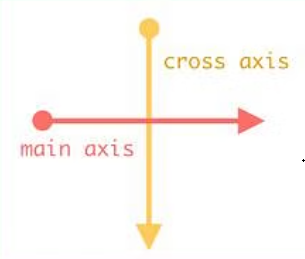
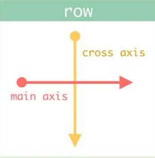
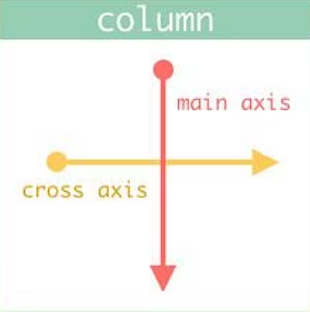
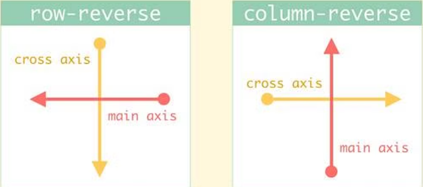

# display: flex;

acomoda los hijos de un contenedor guiado por el sgt cronograma:



es decir, todos los hijos van de izquier a derecha y de arriba abajo, si los hijos no tienen alto definido trata de ocupar todo el espacio vertical disponible (cross axis) de su padre.

si no hay espacio suficiente para los hijos, estos no respetaran su tamaño y trataran de acomodarse en la medida que se pueda, aunque si se llega a un exceso optará por desbordar los hijos.

para que sea mas evidente intente forzar que respete el tamaño con min-width

# flex-wrap: nowrap;

para controlar desbordamiento de hijos tenemos flex-wrap, por defecto viene

```
flex-wrap: nowrap;
```

para hacer que el contenido no desborde y salte de linea se usa

```
flex-wrap: wrap;
```

el salto de linea lo hace guiado por el cross axis, es decir salta para abajo

si usamos wrap-reverse; este cambia la dirección del cross axis

```
flex-wrap: wrap-reverse;
```

es decir el salta para arriba

# flex-direction: row;

el eje principal es main axis y el secundario cross axis. con flex-direction se puede cambiar la dirección del eje principal, la propiedad por defecto tiene row

```
flex-direction: row;
```



cambiamos row por colum

```
flex-direction: colum;
```



si ponemos row-reverse o colum-reverse simplemente cambiará la dirección en la que esté main axis, ya sea vertical u horizontal



# flex-flow: row nowrap;

```
flex-direction: row;
flex-wrap: nowrap;
```

engloba las 2 anteriores props en 1 sola

```
flex-flow: row nowrap;
```

el orden realmente no importa, pero me gusta poner primero la dirección y luego si se colapsan o no.
